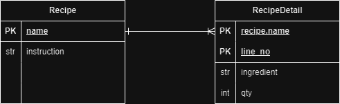

# Oh no! What to Cook?
## Overview

Don’t know what to do with the leftover groceries at home?

This project is a FastAPI-based web application designed to suggest recipes based on the grocery items you already have at home. 

By inputting ingredients like tomatoes and eggs, the application generates recipe suggestions like tomato egg drop soup, and tomato scrambled egg.

### Why this project?
This project is part of my transition from digital makreitng into data analysis/ business analysis. It showcases my ability to design and manage data systems, build user-centric web applications in the retail domain and apply technology to solve practical problems. 


## Features
- **User Input**: Accepts a list of grocery items from user
- **Recipe Recommendations**: Suggests recipes based on grocery items 
- **Database Integration**: Stores and retrieves data on grocery items, recipes and recipe details using SQLite

## Entity Relationship Diagram



## Tech Stack
- **Backend**: FastAPI
- **Database**: SQLite using SQLAlchemy ORM

## How to run
### Install the Python dependencies
```python
pip install requirement.txt
```
### Start FastAPI application
```
fastapi run main.py
```